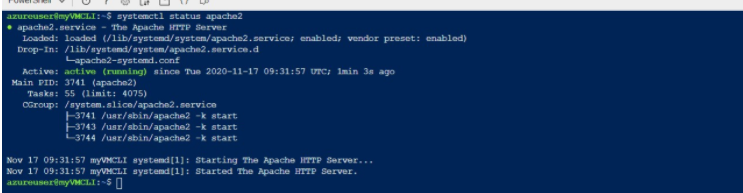

# Trabajo Final AZ_900 

## 1 - Conectarse desde Azure Cli A Azure
    az login
Esto nos abirá una pestaña en la que verificaremos nuestra cuenta

## 2 - Crear un grupo de recursos
    az group create -l EastUS -n myRGCLI 
Y el grupo creada se mostrará así

## 3 - Crear una máquina virtual Linux
    az vm create ^
    --name myVMCLI ^
    --resource-group myRGCLI ^
    --image UbuntuLTS ^
    --location EastUS ^
    --admin-username azureuser ^
    --admin-password Pa$$w0rd1234 ^
    --no-wait

A continuación vemos como se ha creado:

## 4 - Averiguar la dirección IP

Podemos averiguar la dirección IP de la máquina virtual recién creada o bien través del siguiente comando:

    az vm list-ip-addresses --resource-group myRGCLI --name myVMCLI

O en el portal de Azure:

## 5 - Conectarse a la máquina Virtual de Linux

    ssh azureuser@23.96.31.14

Seleccionamos "yes" en la creación del certificado SSH y escribimos la contraseña.

## 6 - Actualizar en Linux

    sudo apt-get update

## 7 - Hacer el upgrade

    sudo apt upgrade

Y le damos a "Y"

## 8 - Instalar un servidor web

    sudo apt install -y apache2 apache2-utils

## 9 - Vemos el estatus de Apache

    systemctl status apache2

## 10 - Ponemos un mensaje en nuestra página de Apache

    cd /var/www/html

## 11 - Poner una nota en la página inde.html

    sudo vi index.html <ENTER>
    <ESC> : 198 <ENTER> // irme a la linea 198 que es donde esta el mensaje de index.html
    <i> PONER EL MENSAJE <ESC>
    : x <ENTER>

## 12 - Salir del SSH

    exit <ENTER>

## 13 - Abrimos el puerto 80

Lo creamos en el portal de Azure

## Comprobamos que ha funcionado y lo cambios se han realizado

## 14 - Parar y "deallocate" la máquina virtual

    az vm stop --resource-group myRGCLI --name myVMCLI --no-wait
    
    az vm deallocate -g myRGCLI -n myVMCLI --no-wait

## 15 - Borrar la máquina virtual

    az vm delete -g myRGCLI -n myVMCLI --yes --no-wait

## 16 - Borrar el grupo de recursos

    az group delete -n myRGCLI  --yes --no-wait

## 17 - Desconectamos de Azure

    az logout

